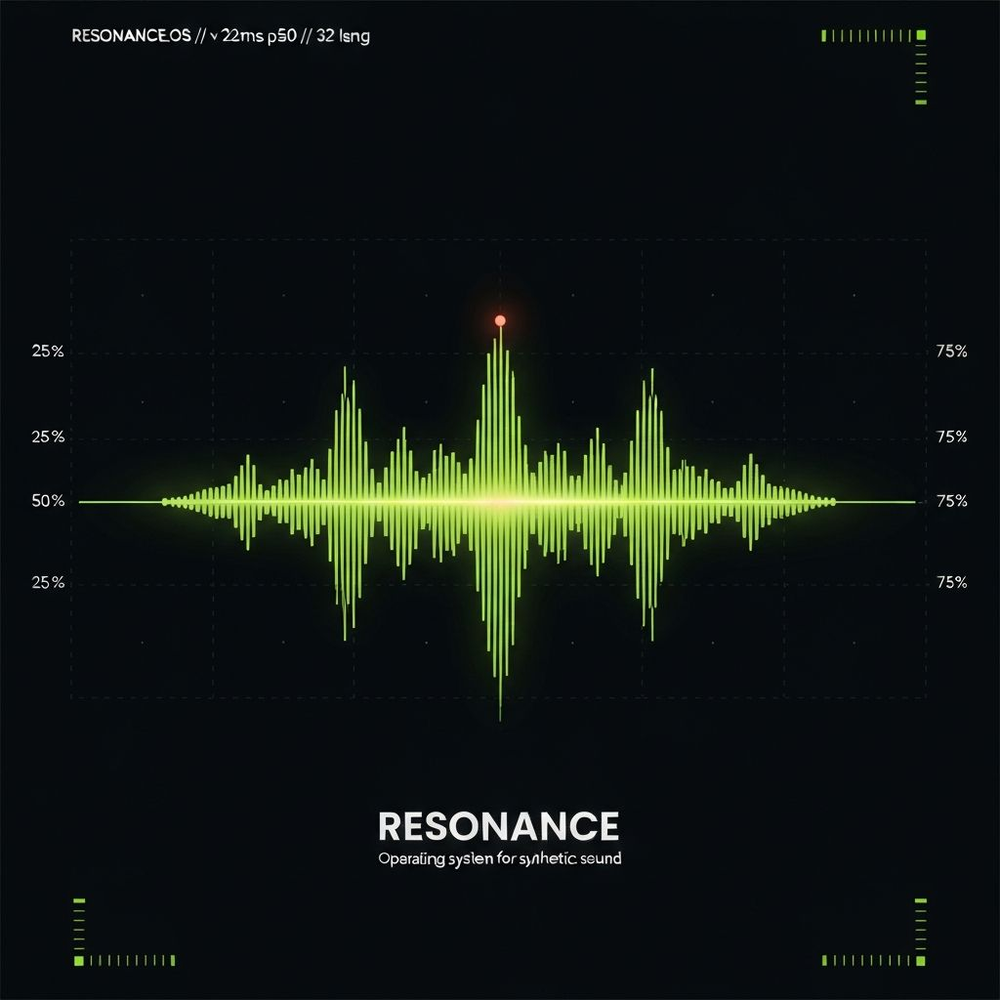

# Resonance OS — A Futuristic ElevenLabs Redesign

A complete UI/UX redesign of [ElevenLabs.io](https://elevenlabs.io), reimagined as the *operating system for synthetic sound*. Where the original feels editorial, **Resonance OS** feels like a control surface — telemetric, cinematic, instrumented.

Built with Next.js 16, Tailwind CSS v4, and a real ElevenLabs Text-to-Speech integration.



---

## What's inside

Three flagship pages from the marketing site:

- **Landing** — hero with a real audio-reactive TTS demo, product bento for all seven instruments, live-counting stats, developers band with multi-language code tabs, enterprise pillars, and a closing CTA.
- **Voice Library** (`/voices`) — searchable, filterable directory where every card calls the real ElevenLabs API on click and renders the returned audio as a live frequency spectrum on its own canvas.
- **Pricing** (`/pricing`) — five tier cards with a billing toggle and a sticky comparison matrix.

The signature interaction is the **hero demo**: type any text, pick a voice, hit play, and the lime-green waveform pulses in real time to the actual ElevenLabs audio coming back from the server.

---

## Design system

| Token | Value | Role |
|---|---|---|
| `--background` | near-black `#0A0B0D` | App canvas |
| `--foreground` | `#F2F4F7` | Primary text |
| `--muted` | warm neutrals | Secondary surfaces and copy |
| `--primary` | electric lime `#D4FF3A` | Signal accent, CTAs, waveform peaks |
| `--accent` | warm coral `#FF6A3D` | Human-facing accents, talent badges |

- **Typography** — Geist Sans for display and body, Geist Mono for telemetry, code, and timecodes. Tight tracking on display (`-0.035em` to `-0.045em`).
- **Layout language** — 12-column grid with hairline section rules, register-mark corner ticks, generous vertical rhythm, sticky spec rails on detail surfaces, and a bento grid for the product matrix.
- **Motion** — mechanical, never bouncy. Custom easing, scroll-reveal stagger via a single global `IntersectionObserver`, conic-gradient hover rings on bento cards, density-shifting header on scroll, and a 1px lime scroll-progress strip pinned to the top. `prefers-reduced-motion` is respected end-to-end.
- **Accessibility** — WCAG AA contrast, semantic landmarks, full keyboard navigation, focus rings on the lime primary, `aria-label`s on icon-only buttons, no autoplay with sound.

---

## Tech stack

- **[Next.js 16](https://nextjs.org)** App Router with React Server Components and tiny client islands per interactive component
- **[Tailwind CSS v4](https://tailwindcss.com)** with theme tokens defined in `app/globals.css`
- **[shadcn/ui](https://ui.shadcn.com)** primitives, themed to the Resonance OS palette
- **[Lucide](https://lucide.dev)** icons
- **Web Audio API** — `MediaElementAudioSourceNode → AnalyserNode` powers the live waveform
- **[ElevenLabs](https://elevenlabs.io)** TTS API (`eleven_multilingual_v2`)
- **[Vercel](https://vercel.com)** for hosting, env vars, edge-ready route handlers, and analytics

No external state, motion, or animation libraries — everything ships with the framework.

---

## How the ElevenLabs integration works

End-to-end and production-shaped:

- **Server-only API key.** A Next.js Route Handler at `app/api/tts/route.ts` reads `ELEVENLABS_API_KEY` from the environment. The browser never sees the key.
- **Real synthesis.** The route POSTs to `https://api.elevenlabs.io/v1/text-to-speech/{voice_id}` with `eleven_multilingual_v2` and streams `audio/mpeg` back to the client.
- **Real audio reactivity.** The returned MP3 plays through a hidden `<audio>` element wired into `MediaElementAudioSourceNode → AnalyserNode → destination`. The hero canvas and every voice card pull live frequency data from that analyser at 60fps.
- **Structured error handling.** ElevenLabs's `detail` envelope is parsed and returned with a machine-readable `code` (`quota_exceeded`, `invalid_key`, `rate_limited`, `upstream_error`). The UI surfaces a clear badge plus a one-click link to billing on quota issues.
- **Per-voice, per-text caching.** Generated clips are memoized by `voiceId + text` in memory so repeat plays are instant and don't re-bill the account.

---

## Getting started

### 1. Clone and install

```bash
git clone https://github.com/YOUR_USERNAME/elevenlabs-redesign.git
cd elevenlabs-redesign
pnpm install
